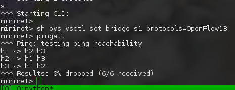
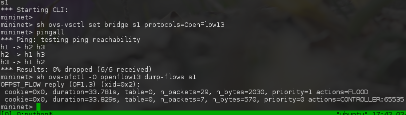
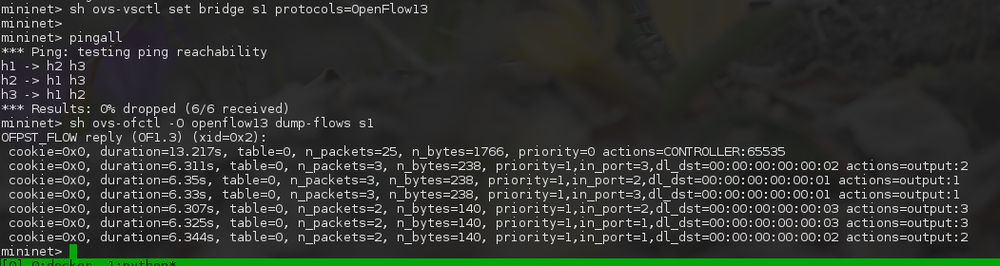
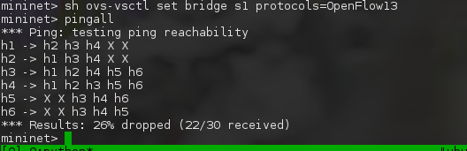
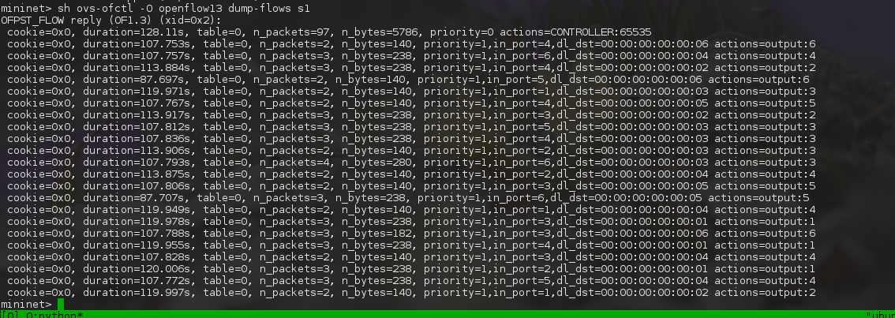

# CldInf Prak Ryu

## Exercises

### Exercise 1: Ein dummer Hub
```bash
# Clear old topologies
mn -c

# Execute controller:
docker run -ti -p 6633:6633 -v `pwd`/controllers:/opt/ryu/ryu/app/my/ hsrnetwork/ryu ryu-manager --verbose ryu/app/my/hub.py
```

```bash
# Create new topology
mn --topo single,3 --mac --controller remote

## Set OVSwitch to OpenFlow13
mininet> sh ovs-vsctl set bridge s1 protocols=OpenFlow13

## Test connectivity
mininet> pingall
```




### Exercise 2: Ein (nicht ganz) dummer Hub mit geschriebenen Flows
```bash
# Clear old topologies
mn -c

# Execute controller
docker run -ti -p 6633:6633 -v `pwd`/controllers:/opt/ryu/ryu/app/my/ hsrnetwork/ryu ryu-manager --verbose ryu/app/my/hub_flow.py
```

```bash
# Create new Topology
mn --topo single,3 --mac --controller remote

## Set OVSwitch to OpenFlow13
mininet> sh ovs-vsctl set bridge s1 protocols=OpenFlow13

## Test connectivity
mininet> pingall

## Display Flows on Switch s1
mininet> sh ovs-ofctl -O openflow13 dump-flows s1
```



### Exercise 3: Ein einfacher Switch
Hinweis: unsere Switch implementation hat kein STP, d.h. es kann broadcast-storms geben.

```bash
# Clear old topologies
mn -c

# Execute Controller:
docker run -ti -p 6633:6633 -v `pwd`/controllers:/opt/ryu/ryu/app/my/ hsrnetwork/ryu ryu-manager --verbose ryu/app/my/switch.py
```

```bash
# Create new Topology
mn --topo single,3 --mac --controller remote

## Set OVSwitch to OpenFlow13
mininet> sh ovs-vsctl set bridge s1 protocols=OpenFlow13

## Test connectivity
mininet> pingall

## Display Flows on Switch s1
mininet> sh ovs-ofctl -O openflow13 dump-flows s1
```



### Exercise 4: Ein Policy-Based controller
```bash
# Clear old topologies
mn -c

# Execute Controller:
docker run -ti -p 6633:6633 -v `pwd`/controllers:/opt/ryu/ryu/app/my/ hsrnetwork/ryu ryu-manager --verbose ryu/app/my/policy_based_controller.py
```

```bash
# Create new Topology
mn --topo single,6 --mac --controller remote

## Set OVSwitch to OpenFlow13
mininet> sh ovs-vsctl set bridge s1 protocols=OpenFlow13

## Test connectivity
mininet> pingall

## Display Flows on Switch s1
mininet> sh ovs-ofctl -O openflow13 dump-flows s1
```




# Basics
- [First Application](https://ryu.readthedocs.io/en/latest/writing_ryu_app.html)
- [Packet library](https://ryu.readthedocs.io/en/latest/library_packet.html)

# Python
- [Python Doc](https://docs.python.org/3/tutorial/)
- `$ pydoc dict`
